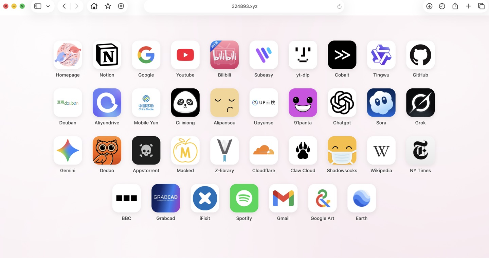

# 🧭 My Homepage - 一个功能强大的浏览器起始页

一个极简、美观且功能强大的浏览器起始页，采用仿 iOS 的毛玻璃与圆角设计风格。现已全面升级，支持用户系统、云端同步、多页面管理等高级功能。

纯静态 HTML/CSS/JS 实现：前端是静态文件，登录与云同步由仓库自带的 **Cloudflare Pages Functions + D1** 提供，不依赖第三方后端，push 到 `main` 即自动上线。



## ✨ 主要功能 (Features)

*   **☁️ 用户系统与云端同步**
    *   **多方式登录**：支持邮箱/密码注册登录，以及 Google、GitHub 第三方 OAuth 登录。
    *   **数据云端同步**：书签和配置与用户账户绑定，自动同步到云端，多设备无缝访问。
    *   **实时同步状态**：界面右下角会显示“正在同步...”、“云端已同步”或“同步失败”等状态，数据安全有保障。
    *   **账户偏好设置**：用户可以自定义显示名称和头像。头像支持从多种风格的图标库中选择，或粘贴自定义图片 URL。

*   **🎨 精美的 UI 与交互**
    *   **仿 iOS 设计**：精美的毛玻璃背景、圆角卡片、平滑的交互动画。
    *   **多页面管理**：支持创建、重命名、拖拽排序和删除多个书签页面，通过手势滑动或键盘左右箭头即可轻松翻页。
    *   **丰富的主题**：内置多种马卡龙纯色背景和动态背景图案（如极光、流光），一键切换并保存偏好。
    *   **国际化**：支持 12 种语言一键切换（中/英/日/韩/德/法/西/意/葡/俄/阿拉伯/繁体中文）。

*   **✏️ 强大的可视化编辑**
    *   **拖拽排序**：通过用户下拉菜单进入编辑模式，支持在页面内或跨页面拖拽改变图标顺序。
    *   **自动获取图标**：输入网址，系统会自动从 Manifest, Brandfetch, Logo.dev 等多个源获取高清图标。
    *   **随机图标生成**：内置 DiceBear API，支持生成几何、像素、手绘等多种风格的随机头像。
    *   **实时预览**：修改过程中可实时看到图标和标题效果。

*   **💾 数据管理**
    *   支持从 `homepage_config.json` 或旧版 `bookmarks.json` 导入配置，方便迁移。
    *   支持将当前配置导出为 `homepage_config.json`，随时备份。
    *   支持导入 Chrome、Firefox、Safari 等浏览器导出的 HTML 书签，并按文件夹合并为书签页面。
    *   支持将当前书签导出为浏览器可识别的 HTML 文件，方便迁移或备份。

*   **📱 移动端适配**
    *   完美支持 PWA（添加到主屏幕）。
    *   添加到 iPhone/iPad 桌面后支持全屏沉浸式显示，拥有独立 App 图标。

## 🚀 快速开始 (Getting Started)

### 1. 部署

最简单的方式是直接使用已部署的版本：[https://324893.xyz/](https://324893.xyz/)

如果你想自行部署（Cloudflare Pages，push 到 `main` 自动上线）：

1.  **Fork** 本仓库到你的 GitHub 账号。
2.  打开 Cloudflare Dashboard -> **Workers & Pages** -> **Create** -> **Pages** -> **Connect to Git**，选择该仓库。
3.  构建配置：Framework preset 选 **None**，Build command 留空，Build output directory 填 `/`。
4.  部署完成后在 **Custom domains** 绑定自己的域名（仓库根目录的 `_headers` 会控制缓存策略）。

也可继续使用 GitHub Pages：仓库 **Settings** -> **Pages** -> Source 选 `Deploy from a branch`，Branch 选 `main`。

### 2. （可选）配置你自己的后端

登录、用户配置与收藏由仓库内的 Pages Functions（`functions/api/[[path]].js`）提供，数据存放在 D1；前端通过 `/api/*` 调用，不依赖任何第三方后端。

1.  创建 D1 数据库：

    ```bash
    wrangler d1 create homepage-auth
    ```

2.  把命令返回的 `database_id` 填入根目录 `wrangler.toml` 的 `[[d1_databases]]`。
3.  建表：

    ```bash
    wrangler d1 execute homepage-auth --remote --file=migrations/0001_init.sql
    ```

4.  （可选）启用 Google / GitHub 登录，在 Pages 项目里添加加密变量：

    | 变量 | 说明 |
    | --- | --- |
    | `GOOGLE_CLIENT_ID` / `GOOGLE_CLIENT_SECRET` | Google Cloud Console 的 OAuth 客户端 |
    | `GITHUB_CLIENT_ID` / `GITHUB_CLIENT_SECRET` | GitHub OAuth App 的凭据 |

    回调地址：`https://你的域名/api/auth/callback/google` 与 `https://你的域名/api/auth/callback/github`。未配置时对应按钮会提示 "not configured yet"，邮箱+密码登录始终可用。
5.  密码使用 PBKDF2-SHA256（WebCrypto）存储，会话为 HttpOnly + Secure + SameSite=Lax 的随机令牌，存于 D1 的 `sessions` 表。

### 3. （可选）把 www 跳转到主域名

`workers/` 下有一个独立的小 Worker，把 `www.你的域名/*` 301 到主域名，保证登录态与 SEO 唯一：

```bash
wrangler deploy --config workers/wrangler.toml
```

注意：Worker 路由只对**经过 Cloudflare 代理（橙云）**的流量生效，因此 www 那条 DNS 记录需保持橙云；主域名可以继续用灰云，从而原样透传 Pages 的响应头。

## 🛠️ 使用方法

1.  **注册/登录**：打开页面后，点击左上角的用户图标进行注册或登录。
2.  **编辑模式**：登录后，再次点击用户头像，在下拉菜单中选择“编辑书签”进入编辑模式。
3.  **添加/修改书签**：在编辑模式下，点击“添加书签”或直接点击已有书签进行修改。
4.  **管理页面**：在编辑模式下，点击“编辑页面”来添加、删除或重命名页面。
5.  **切换主题**：点击用户头像，在下拉菜单中选择“编辑主题”来更换背景颜色和图案。
6.  **数据导入/导出**：在编辑模式下，通过“导入”和“导出”菜单选择 JSON 配置或浏览器 HTML 书签格式。

---

感谢使用！如果你有任何建议或问题，欢迎提交 Issue 或 Pull Request。
